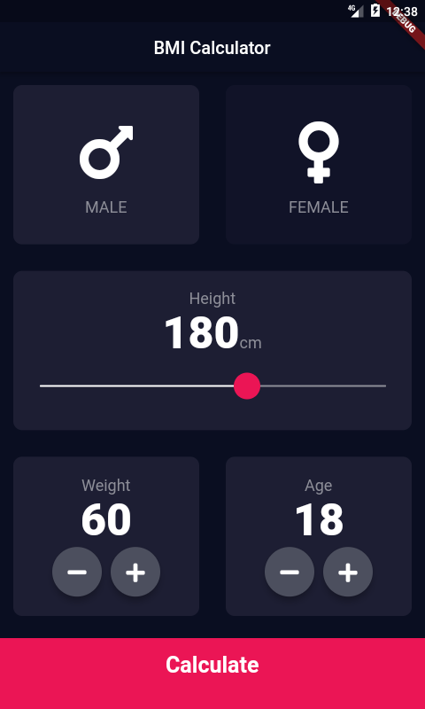

# bmi_calculator

A new Flutter application.

## Getting Started
 <h2> Calculate your BMI with this interesting app </h2>
 
 
 
This project is a starting point for a Flutter application.

A few resources to get you started if this is your first Flutter project:

Usage examples
This example first cleans any stale build, gets and updates the dependencies with flutter pub get and then builds a release apk to run on all mobile devices(android) and runs the flutter tests in parallel.

action.yml
name: 'bmi-calculator'
description: 'Github Flutter action for apk building for arm64 flutter apps.'
runs:
  using: 'docker'
  image: 'Dockerfile'
  ---------------------------------------
main.yml
on: push
name: cleans, build and test app (mobile - android)
jobs:
  build:
    name: install dependencies
    runs-on: ubuntu-latest
    steps:
    - uses: actions/checkout@master

    - name: clean stale build and cache
      uses: ./action
      with:
        args: clean

    - name: install dependencies
      uses: ./action
      with:
        args: pub get

    - name: build apk
      uses: ./action
      with:
        args: build apk --release -target-platform android-arm64

- [Cookbook: Useful Flutter samples](https://flutter.dev/docs/cookbook)

For help getting started with Flutter, view our
[online documentation](https://flutter.dev/docs), which offers tutorials,
samples, guidance on mobile development, and a full API reference.
